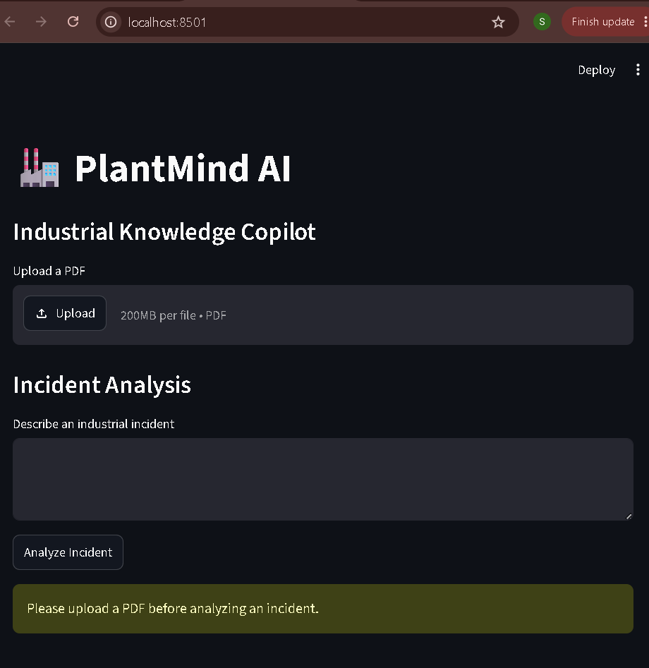
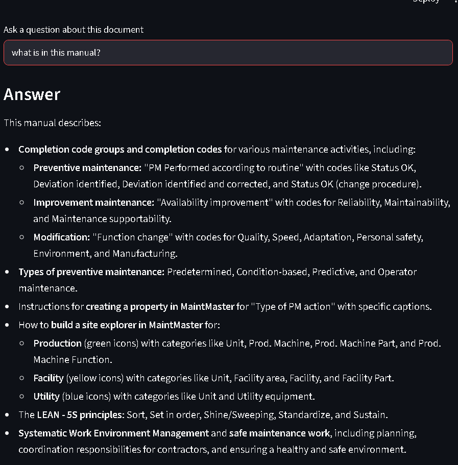
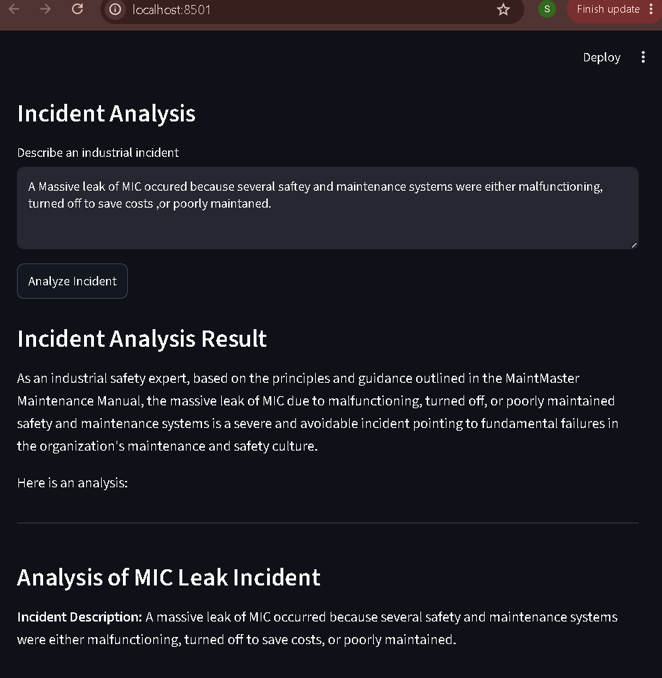

<div align="center">

<br/>

<!-- Animated Banner -->


<br/>

<p align="center">


</p>

<p align="center">
  <a href="#-demo">View Demo</a> •
  <a href="#-features">Features</a> •
  <a href="#-architecture">Architecture</a> •
  <a href="#-installation">Installation</a> •
  <a href="#-usage">Usage</a>
</p>

<br/>

> **Stop searching through hundreds of pages. Ask your documents directly.**
>
> PlantMind AI is an intelligent document assistant built for industrial engineers — combining RAG, semantic search, and Google Gemini to surface critical knowledge from manuals, SOPs, and safety documents in seconds.

<br/>

</div>

---

## 🎬 Demo

<div align="center">

| 📤 Upload & Summarize | 🔍 Ask Questions | 🚨 Incident Analysis |
|:-:|:-:|:-:|
| <a href="assets/upload.png"></a> | <a href="assets/question-answer.png"></a> | <a href="assets/incident-analysis.png"></a> |
|:---:|:---:|:---:|
| <b>📄 Upload PDF</b> | <b>❓ Ask Questions</b> | <b>⚠️ Incident Analysis</b> |
| Upload any industrial PDF and get an AI-generated summary instantly | Ask natural language questions and get context-aware answers | Investigate incidents using document-grounded knowledge |


</div>

---

## 🧠 The Problem It Solves

```
Traditional Approach                    PlantMind AI
─────────────────────────────────────   ──────────────────────────────────────
📂 Open maintenance manual              📄 Upload your PDF
🔍 Ctrl+F to search keywords            💬 "What is the shutdown procedure for Pump A?"
📖 Read through 200+ pages              ⚡ Get a precise, context-aware answer in seconds
📝 Copy relevant sections manually      📌 See exactly which context was used
😤 Repeat for every question            ✅ Done.
```

Industrial knowledge is buried across maintenance manuals, SOPs, operating procedures, and safety documentation. During maintenance windows or incident investigations, every minute of manual searching costs time — and safety.

PlantMind AI solves this by turning your static documents into an intelligent, queryable knowledge base.

---

## ✨ Features

<table>
<tr>
<td width="50%">

### 📄 Document Intelligence
- ✅ Upload any industrial PDF
- ✅ Automatic text extraction with PyPDF
- ✅ AI-generated document summaries
- ✅ Smart text chunking for accuracy

</td>
<td width="50%">

### 🔍 RAG-Powered Search
- ✅ Semantic search using FAISS vector store
- ✅ Sentence Transformer embeddings
- ✅ Context-aware Q&A with Gemini 2.5 Flash
- ✅ Retrieved context transparency

</td>
</tr>
<tr>
<td width="50%">

### 🚨 Incident Analysis
- ✅ Document-grounded incident investigation
- ✅ SOP compliance checking
- ✅ Root cause assistance

</td>
<td width="50%">

### 🖥️ Interactive Interface
- ✅ Clean Streamlit web UI
- ✅ Real-time AI responses
- ✅ No backend infrastructure needed
- ✅ Runs fully local or on cloud

</td>
</tr>
</table>

---

## 🏗️ Architecture

```
                    ┌─────────────────────┐
                    │    User Uploads PDF  │
                    └──────────┬──────────┘
                               │
                    ┌──────────▼──────────┐
                    │   PDF Text Extraction│  ← PyPDF
                    └──────────┬──────────┘
                               │
                    ┌──────────▼──────────┐
                    │    Text Chunking     │  ← Overlapping windows
                    └──────────┬──────────┘
                               │
                    ┌──────────▼──────────┐
                    │  Sentence Embeddings │  ← Sentence Transformers
                    └──────────┬──────────┘
                               │
                    ┌──────────▼──────────┐
                    │  FAISS Vector Store  │  ← Semantic Index
                    └──────┬──────────────┘
                           │
           ┌───────────────┼────────────────┐
           │               │                │
    ┌──────▼──────┐  ┌─────▼──────┐  ┌─────▼──────┐
    │ User Query  │  │  Summary   │  │  Incident  │
    └──────┬──────┘  │ Generation │  │  Analysis  │
           │         └────────────┘  └────────────┘
    ┌──────▼──────┐
    │  Semantic   │
    │  Retrieval  │
    └──────┬──────┘
           │
    ┌──────▼──────────────────┐
    │  Google Gemini 2.5 Flash │  ← Grounded in your docs
    └──────┬──────────────────┘
           │
    ┌──────▼──────┐
    │ AI Response │
    │ + Context   │
    └─────────────┘
```

---

## 🛠️ Technology Stack

<div align="center">

| Layer | Technology | Purpose |
|:------|:-----------|:--------|
| **Frontend** |  | Interactive web interface |
| **LLM** |  | Language understanding & generation |
| **Embeddings** |  | Semantic text representations |
| **Vector Search** |  | Fast similarity search |
| **PDF Processing** |  | Text extraction |
| **Backend** |  | Core application logic |

</div>

---

## 📂 Project Structure

```
PlantMind-AI/
│
├── 📄 app.py                  # Main Streamlit application
├── 📋 requirements.txt        # Python dependencies
├── 🔐 .env.example            # Environment variable template
│
├── src/
│   ├── 🤖 llm.py              # Google Gemini integration
│   ├── 📑 pdf_processor.py    # PDF extraction & chunking
│   ├── 💬 prompts.py          # Prompt engineering templates
│   ├── 🔍 rag.py              # FAISS vector store & retrieval
│   ├── 🚨 incident.py         # Incident analysis module
│   └── 🛠️  utils.py            # Helper utilities
│
├── assets/                    # Screenshots & media
└── sample_docs/               # Example industrial PDFs
```

---

## 🚀 Installation

### Prerequisites
- Python 3.10+
- A free [Google AI Studio API key](https://aistudio.google.com/app/apikey)

### Steps

**1. Clone the repository**
```bash
git clone https://github.com/YOUR_USERNAME/PlantMind-AI.git
cd PlantMind-AI
```

**2. Create and activate a virtual environment**
```bash
# Create
python -m venv venv

# Activate — Windows
venv\Scripts\activate

# Activate — Linux/macOS
source venv/bin/activate
```

**3. Install dependencies**
```bash
pip install -r requirements.txt
```

**4. Configure your API key**
```bash
# Create .env file
cp .env.example .env

# Add your Gemini API key inside .env
GEMINI_API_KEY=your_api_key_here
```

**5. Run the application**
```bash
streamlit run app.py
```

Open [http://localhost:8501](http://localhost:8501) — you're live! 🎉

---

## 📖 Usage

```
1. Upload PDF        →   Drag & drop any industrial manual or SOP
2. Get Summary       →   Click "Generate Summary" for an AI overview
3. Ask Questions     →   Type any question in natural language
4. View Context      →   See exactly which document sections were used
5. Analyze Incident  →   Use the incident tab for root cause analysis
```

### 💡 Example Questions You Can Ask

```
"What is the startup procedure for the cooling tower?"
"What are the safety precautions before entering a confined space?"
"What maintenance interval is recommended for the hydraulic pump?"
"Which SOP applies to high-pressure steam line repairs?"
"Summarize the emergency shutdown procedure."
```

---

## 🗺️ Roadmap

| Status | Feature |
|:------:|:--------|
| ✅ | PDF upload & text extraction |
| ✅ | FAISS semantic search |
| ✅ | Gemini-powered Q&A |
| ✅ | Document summarization |
| ✅ | Incident analysis |
| 🔄 | Page-level citations |
| 🔄 | Multi-document cross-search |
| 🔄 | OCR for scanned PDFs |
| 🔄 | Persistent chat history |
| 🔄 | Export summaries to PDF |
| 🔄 | ChromaDB / cloud vector store |
| 🔄 | User authentication |
| 🔄 | Cloud deployment (Streamlit Cloud / GCP) |

---

## 🎯 Use Cases

<table>
<tr>
<td align="center">⚙️<br/><b>Maintenance</b><br/>Search equipment manuals in seconds</td>
<td align="center">📋<br/><b>SOP Lookup</b><br/>Instant procedure retrieval</td>
<td align="center">🔧<br/><b>Troubleshooting</b><br/>Diagnose faults with doc context</td>
</tr>
<tr>
<td align="center">🚨<br/><b>Incident Investigation</b><br/>Root cause from safety docs</td>
<td align="center">🛡️<br/><b>Safety Compliance</b><br/>Verify procedures against standards</td>
<td align="center">📚<br/><b>Knowledge Transfer</b><br/>Onboard new engineers faster</td>
</tr>
</table>

---

## 👩‍💻 Author

<div align="center">

**Siddhant**

*Building AI tools that solve real engineering problems*

<br/>

[](https://github.com/ulekarsiddhant0-boop)
[](https://www.linkedin.com/in/siddhant-ulekar-601166382)

</div>

---

## 📄 License

This project is open source and available under the [MIT License](LICENSE).

---

<div align="center">


<br/>

*If this project helped you, consider giving it a ⭐ — it means a lot!*

</div>
